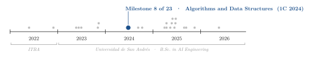
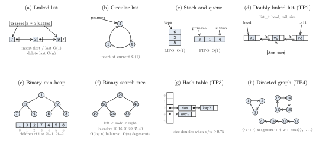
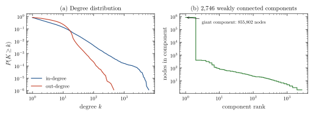

<div align="center">

# Algorithms and Data Structures: Course Notes, C Implementations and a Web-Graph Analysis

**Santiago Groba Alonso**

Universidad de San Andrés · *Algorithms and Data Structures* · First semester 2024 · Course notes and Assignments 1–4

[](#reproducing-the-results)
[](#reproducing-the-results)
[](#reproducing-the-results)

<picture>
  <source media="(prefers-color-scheme: dark)" srcset="docs/figures/trajectory-dark.svg">
  
</picture>

</div>

> **Abstract.** This repository is the working log of a first-semester course on algorithms and data structures, kept between March and June 2024. It holds two kinds of material: short C files with the notes of each class (lists, stacks and queues, heaps, binary search trees, sorting, balanced trees) and the four graded assignments. Three assignments are in C with the course's test harness: a warm-up on arrays, pointers and dynamic memory; a doubly linked list with a bidirectional iterator; and a dictionary implemented as a hash table with separate chaining, Jenkins' one-at-a-time hash and doubling at load factor 0.75. The fourth analyses the Google web graph (875,713 pages, 5,105,039 links) in Python. Re-running everything for this README, the warm-up and the dictionary pass all their tests (11/11 test functions each), the linked list in the repository is an intermediate version that passes 19 of 41, and the graph results that could be recomputed independently with SciPy (largest component of 855,802 pages out of 2,746, 11,669,313 closed 3-walks, clustering coefficient 0.365) match the ones saved by the assignment.

---

## 1. Course map

The notes are written as C files with comments in Spanish, one per class. Class 12 and `Vectores.c` are empty.

**Table 1.** Topics recorded in the class notes.

| File | Topics |
|---|---|
| `notas_algoritmos_clase_3.c` | Singly linked list with a pointer to the last node; circular list (create, destroy, insert at current) |
| `notas_algoritmos_clase_4.c` | Cost of list operations with and without a tail pointer; stack and queue on linked nodes; queue from two stacks; the "carnival" ordering problem with a stack and a queue |
| `notas_algoritmos_clase_6.c` | Priority queue as a linked list; binary trees, complete trees and the height bounds $h+1 \le n \le 2^{h+1}-1$; heap definition |
| `notas_algoritmos_clase_7.c` | Binary min-heap costs; tournament trees, tournament heaps, lazy tournament heaps and abdication heaps, with the cost of each primitive |
| `notas_algoritmos_clase_9.c` | Binary search tree: insert, delete with in-order successor, search, pre-order and in-order traversals |
| `notas_algoritmos_clase_10.c` | Comparison sorts (bubble, selection, insertion, shell, quick, merge, heap) and non-comparison sorts (counting, radix); linear, binary and interpolation search; skip lists |
| `notas_algoritmos_clase_11.c` | Dictionaries over arrays, skip lists and trees; AVL trees and rotations; red-black trees; B-trees, 2-3-4 trees and B+ trees |
| `Parcial_Modelo.c` | Mock midterm: choosing a sorting algorithm for a given input, drawing BST insertions, best-case costs, an amortized stack exercise |

**Table 2.** Assignments.

| Folder | Assignment | Language | Interface |
|---|---|---|---|
| `tp1/` | Warm-up: primes, integer arrays, pointers, copies in dynamic memory, bubble sort, array "anagrams" | C99 | `tp1.h` (11 functions) |
| `tp2/` | Doubly linked list of `void *` with a bidirectional iterator that can insert and delete in place | C99 | `tp2.h` (21 functions) |
| `tp3/` | Dictionary `char * → void *` as a hash table with separate chaining and rehashing; extra points: a duplicate-free list that uses the dictionary as a membership filter | C99 | `tp3.h` (8 functions) |
| `tp4/` | Analysis of the SNAP `web-Google` graph with a dictionary-based `Graph` class: components, shortest paths, triangles, diameter, PageRank, longest cycle; extra points: polygons, clustering, betweenness | Python | `graph.py`, `tp4.py` |

## 2. Methods

| Component | Choice |
|---|---|
| Build | `gcc -std=c99 -Wall -Wconversion -Werror`, then `valgrind --leak-check=full` on the test binary; a Dockerfile per assignment reproduces the course environment |
| Allocation failures | `-Wl,--wrap=malloc` lets the tests switch `malloc` off and check that every constructor returns `NULL` or `false` cleanly |
| Linked list (TP2) | Nodes with `prev` and `next`; the list keeps `head`, `tail` and `size`; the iterator stores the list and its current node |
| Hash table (TP3) | Initial size 5, Jenkins one-at-a-time hash modulo the table size, new keys pushed at the head of their chain, table doubled and all nodes re-linked when $n/m \ge 0.75$; keys are copied with `malloc` + `strcpy` |
| Graph (TP4) | Dictionary of vertices, each with a dictionary of out-neighbours; iterative DFS for components, BFS for distances, sampling from random start vertices when the exact computation is too slow |

## 3. Results

### 3.1 The structures implemented

<p align="center"></p>

**Figure 1.** The structures that appear in the notes and the assignments, drawn as their C structs lay them out. (a)–(c) classes 3 and 4; (d) TP2, with an iterator positioned on the middle node; (e) a binary min-heap and its array, classes 6–7; (f) a binary search tree, class 9; (g) the TP3 table with its initial 5 buckets after inserting `key1`, `key2` and `dos`, placed with the assignment's own hash function (`key2` and `dos` collide in bucket 2); (h) part of the hand-made test graph `tp4/test.txt`, stored as a dictionary of dictionaries.

### 3.2 Test suites

**Table 3.** Course test suites, compiled with the course flags (GCC 16) and run for this README, one process per test function. The valgrind step of the makefiles was not run.

| Assignment | Test functions | Passed | Notes |
|---|---:|---:|---|
| TP1 | 11 | 11 | 40 assertions, all OK |
| TP2 | 41 | 19 | 3 fail and 19 stop with a segmentation fault; the repository holds an intermediate version (last change on 5 April 2024) |
| TP3 | 11 | 11 | 164 assertions, all OK; compiled from the dictionary section of `tp3.c` (lines 1–234), because the extra-points section at the end of the file defines its own `main` |

### 3.3 The Google web graph

<p align="center"></p>

**Figure 2.** The TP4 dataset, recomputed from `tp4/web-Google.txt`. (a) Complementary cumulative degree distributions: in-degrees reach 6,326 while no page links to more than 456 others. (b) Sizes of the weakly connected components by rank: one giant component and a long tail of small ones.

**Table 4.** Answers saved by the assignment in `tp4/resultados.txt`. "Reproduced" marks the values recomputed independently with SciPy sparse matrices in `docs/figures/make_figures.py`.

| Question | Method in `tp4.py` | Result | Check |
|---|---|---:|---|
| Largest connected component / number of components | DFS on an undirected copy | 855,802 / 2,746 | reproduced |
| Time for all-pairs shortest paths | one BFS timed, times the number of vertices | ≈ 215 h | estimate |
| Triangles | for each $u \to v \to w$, test $w \to u$ | 11,669,313 | reproduced; it counts closed directed 3-walks, i.e. 3 × 3,889,771 directed 3-cycles |
| Diameter | largest BFS depth from 100 random vertices, 6 repetitions | 22 | sampled |
| Longest cycle | DFS from 100 random start vertices | 13,392 | sampled |
| Clustering coefficient (extra) | mean local clustering over out-neighbours | 0.3651 | reproduced (0.365133) |

The remaining entries of `resultados.txt` (PageRank, polygon counts and betweenness) come from sampling heuristics whose outputs are not estimates of those exact quantities, so they are not repeated here.

## 4. Takeaways

- Writing every structure in C made the cost table concrete: a missing tail pointer is the difference between $O(1)$ and $O(n)$ for deleting the last node, and the notes record that trade-off for every primitive.
- The course harness tests failure paths, not only the happy path: with `malloc` wrapped, every constructor must undo its partial allocations, which is why TP2 and TP3 check the result of every `malloc`.
- At 5.1 million edges, a plain-Python dictionary graph is fine for one BFS or DFS but not for all-pairs questions (≈ 215 h estimated), which is why most of the later TP4 questions sample start vertices instead of visiting all of them.

## Reproducing the results

```bash
# C assignments, as in the course (gcc + valgrind, or the provided Dockerfile)
(cd tp1 && make local)        # or: make docker
(cd tp2 && make local)

# TP3: build the dictionary section on its own (the file also contains the extra-points program)
(cd tp3 && head -n 234 tp3.c > /tmp/dict.c &&
 gcc -std=c99 -Wall -Wconversion -Wno-sign-conversion -Werror -Wl,--wrap=malloc -I. \
     -o /tmp/tp3 /tmp/dict.c tests.c testing.c test_malloc.c && /tmp/tp3)

# TP4 (reads web-Google.txt from the working directory)
(cd tp4 && python tp4.py)

# Figures and the checks in Table 4
pip install numpy scipy pandas matplotlib
python docs/figures/make_figures.py
```

| File | Content |
|---|---|
| `notas_algoritmos_clase_*.c`, `Parcial_Modelo.c` | Class notes and mock midterm (Spanish), see Table 1 |
| `tp1/` | `tp1.c`, `tp1.h`, course tests (`tests.c`, `testing.c`), makefile and Dockerfile |
| `tp2/` | `tp2.c`, `tp2.h`, course tests with `malloc` wrapper (`test_malloc.c`), makefile and Dockerfile |
| `tp3/` | `tp3.c` (dictionary, then the extra-points list and its `main`), `tp3+.c` (unfinished draft of the extra points), `README.txt`, course tests |
| `tp4/` | `graph.py` (course `Graph` class), `tp4.py`, `resultados.txt` (saved answers), `test.txt` (small test graph), `prac.py` (coin-change DP practice), `web-Google.txt` (SNAP dataset) |
| `docs/figures/` | Script and style used for the figures in this README |

## Acknowledgements

The test harnesses, makefiles, Dockerfiles, the interface headers of TP1–TP3 and the `Graph` class of TP4 were distributed with the assignments by the course teaching staff. The web graph is the `web-Google` dataset from the Stanford Large Network Dataset Collection (SNAP), originally released for the 2002 Google Programming Contest. Dataset reference: J. Leskovec, K. Lang, A. Dasgupta and M. W. Mahoney, "Community Structure in Large Networks: Natural Cluster Sizes and the Absence of Large Well-Defined Clusters", *Internet Mathematics* 6(1), 29–123, 2009.

## Citation

```bibtex
@misc{groba2024algorithms,
  author       = {Groba Alonso, Santiago},
  title        = {Algorithms and Data Structures: Course Notes, C Implementations and a Web-Graph Analysis},
  year         = {2024},
  howpublished = {Universidad de San Andr{\'e}s, Algorithms and Data Structures},
  url          = {https://github.com/Santi2065/algorithms-and-data-structures-c}
}
```
